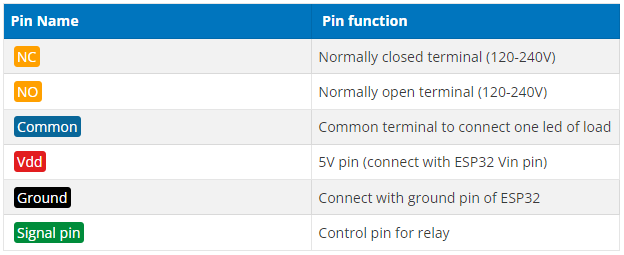

# ESP32 web server control relay and 220 volt lamp

One of the best projects, you can consider doing with ESP32 is to  **control a 220 volts lamp**  from a web server. But you can also use the same procedure to control  **fans, lights, AC or other electrical devices**  that you want to control from a  **web server**. This tutorial is about controlling a relay and 220 volts lamp from a Web Server using  **ESP32**. First, we will see how to interface a relay and bulb with ESP32 and after that, I will show you how to make a webserver to control lamp/bulb from a web page.

## Introduction to a relay module

Relay is an electromechanical device that is used as a switch between high current and low current devices. Its main parts are coil and contacts. We generally apply dc voltages to coil and connect load across normally open and close contacts. When we supply dc voltage across the coil, it starts to energize. When coil fully energized, contact shift from normally open position to normally close position. You can read these articles to gain further details on relays and their working.

-   Introduction to Electromechanical relays.
-   How to control 5 volts relay with Arduino

## Why we need to use relay?

Light bulbs usually operate on 120 volts or 220 volts power supply in case of AC main supply. We can not interface these AC loads directly with ESP32 development board. We have to use a relay between **ESP32 and lamp**. You will use a relay as a switch to control 120-220 volts lamps. We will control relay with ESP32. We will use a button on web page to control a relay. ESP32 will give signal to relay depending upon the button state from a web page. You can use any relay module. However, I will be using SRD-05VDC-SL-C 5V  **Relay module**. It works on and can be used to control output loads from 120-240 volts and current range of 10A.

### How 5V relay module works?

It consists of 6 pins. Three pins are used to connect with high voltage side i.e. electrical loads and 220 volts power supply and other three pins are used for low voltage side namely; vcc, ground and control signal pin.

### Relay module pinouts

